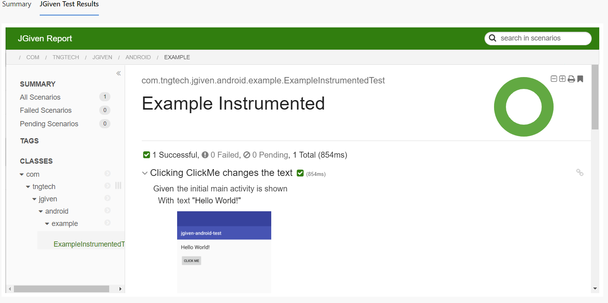

# Azure DevOps - Publish JGiven Reports
This extension enables users to publish JGiven HTML reports to a newly created tab inside the DevOps console, next to the `Summary` tab.

# Usage
## 1. Install the extension from the marketplace
[Insert link here]

## 2. Add JGiven step in your azure pipeline task
```
- script: ./gradlew -b jgiven-examples/build.gradle test
  displayName: 'Test and generate JGiven report'
```

## 3. Include the extension in your pipeline config file as following:
```
- task: publishjgivenreport@1
    inputs:
      jgivenReportPatterns: 'jgiven-examples/**/html5'
      #workingDir: 'custom/working/dir' #if not set, default value is $(Build.SourcesDirectory)
```

The jgivenReportPatterns supports inputting multiple paths, by separating the paths with a `#`.
```
jgivenReportPatterns: 'path_1#path_2#path_3'
```
The syntax for `jgivenReportPatterns` follows the Unix file name matcher mechanism. You can use wildcards such as `*` to match any number of characters or `**` to recursively match subdirectories.

# Screenshot


# License

The JGiven Azure Plugin is published under the Apache License 2.0, see https://www.apache.org/licenses/LICENSE-2.0 or [LICENSE](LICENSE) for details.

# Contributing
See [CONTRIBUTING](CONTRIBUTING.md)

